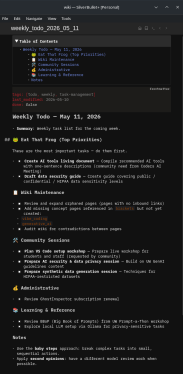

# 🐸 Clinelet

**Transform the VS Code Cline Extension into an automated "Living LLM Wiki" curator agent.**

`clinelet` provides a set of specialized [Cline Rules](https://docs.cline.bot/customization/cline-claude-rules) and an import script designed to ingest raw documents and transform them into a dense, interlinked, and searchable knowledge base — optimized for browsing with the [SilverBullet](https://silverbullet.md/) wiki app. The rules, scripts, and example prompts provided here can be used with almost any agent harness and wiki browser.

Following the organizational principles proposed by [Andrej Karpathy](https://gist.github.com/karpathy/442a6bf555914893e9891c11519de94f), this setup creates a "Living LLM Wiki" — a dense web of interconnected Markdown pages that enable easy discovery and connection between disparate ideas.

---

## 📺 Overview

The following video introduces the concept and demonstrates an implementation with a different toolset (Claude Code and Obsidian wiki):

[](https://www.youtube.com/watch?v=iXd0t60YmMw)

---

## 🛠️ Why VS Code, Cline & SilverBullet?

| Tool | Benefit |
|------|---------|
| **VS Code** | Use other LLMs, especially locally-hosted models via [Ollama](https://ollama.com/download) or [LM Studio](https://lmstudio.ai/download) |
| **Cline** | Easily restrict actions (read/write workspace files, only execute safe commands, no web or MCP access, etc.) |
| **SilverBullet** | Supports Lua scripting and is open source ([self-hosted web app](https://github.com/silverbulletmd/silverbullet/blob/main/LICENSE.md)) or open core ([desktop app](https://silverbullet.plus/faq))|

> **Alternatives:** You can also use [Obsidian](https://obsidian.md) with this setup if preferred. For an open-source VS Code alternative, use [VSCodium](https://vscodium.com).

---

## 🚀 Key Features

| Feature | Description |
|---------|-------------|
| **Automated Ingestion** | Use `scripts/wiki_integrator.py` to process various file formats (`.txt`, `.md`, `.pdf`, `.docx`, etc.) and generate structured wiki pages |
| **Knowledge Management** | Implements a "Living LLM Wiki" approach with interlinked pages for easy discovery |
| **Productivity Focused** | Integrates Brian Tracy's [Eat That Frog!](https://www.briantracy.com/blog/time-management/the-truth-about-frogs/) methodology for task prioritization |
| **Automated Maintenance** | Includes capabilities for "linting" the wiki to identify orphaned pages, broken links, and missing concepts |

---

## 📋 Prerequisites

Ensure the following tools are installed on your system:

| Tool | Requirement |
|------|-------------|
| [Git](https://git-scm.com/) | Version control |
| [Visual Studio Code](https://code.visualstudio.com/) | Editor |
| [Cline Extension](https://marketplace.visualstudio.com/items?itemName=saoudrizwan.claude-dev) | VS Code extension |
| [SilverBullet+ App](https://silverbullet.plus/) | Wiki viewer |
| [Python 3.x](https://www.python.org/) | Scripting runtime ([Miniconda](https://www.anaconda.com/docs/getting-started/miniconda/main) recommended) |

### Additional Python Packages

To process non-text filetypes (`.pdf`, `.docx`, `.xlsx`, `.pptx`), install these additional packages:

```bash
pip install pypdf python-docx openpyxl python-pptx
```

> Cline will automatically detect missing dependencies and prompt you for approval to install them.

---

## ⚙️ Installation

### Step 1: Clone the Repository

```bash
git clone https://github.com/brianhigh/clinelet.git
```

This creates a `clinelet/` folder containing the files from this repository.

### Step 2: Set Up Your Workspace

Create a new directory for your wiki (e.g., `my_wiki/`) with the following structure:

```text
my_wiki/
├── .clinerules/        ← Copy from clinelet/.clinerules/
├── scripts/            ← Copy from clinelet/scripts/
├── raw/                ← Place your source documents here
└── wiki/               ← Your generated knowledge base
```

> **Alternative Agents:** If using another agent framework (Claude Code, Hermes Agent, OpenCode, Codex, etc.), copy `AGENTS.md` to your workspace instead of `.clinerules/`. Cline also recognizes `AGENTS.md`.

### Step 3: Copy Core Components

Copy the `.clinerules/` (or `AGENTS.md`) and `scripts/` folders from this repository into your new workspace directory.

---

## 🛠️ Configuration

### Step 1: Configure Cline

1. Set up your preferred LLM in the Cline extension with these recommendations:

   | Parameter | Recommendation |
   |-----------|----------------|
   | **Context Size** | At least 64k for local models (more is better) |
   | **Tool Use** | Must be supported |

2. **Locally Hosted LLM Guidelines:**

   | Scenario | Recommendation |
   |----------|----------------|
   | General use | `qwen3.5:9b` works; prefer larger models like `gemma4:26b` or `qwen3.6:35b` |
   | Slow performance | Try a smaller model (`qwen3.5:4b`) with a larger context size (`128k`) |
   | Apple Silicon (M-series, <32 GB RAM) | Use [LM Studio](https://lmstudio.ai/download) to serve MLX-quantized models for ~2x speed over Ollama (GGUF) |

3. **Enable these Auto-approve options:**

   - [x] Read project files
   - [x] Edit project files
   - [x] Execute safe commands

### Step 2: Customize Rules (Optional)

Review and edit the following files to align with your specific workflow:

- `.clinerules/personal_agent.md`
- `.clinerules/project_guidelines.md`

Or, alternatively:

- `AGENTS.md`

### Step 3: Initialize the Wiki

1. Open your empty `wiki/` folder in SilverBullet — `index.md` will be created automatically.
2. If `index.md` is not created (or is bare), copy the included `index.md` into `wiki/`.
3. Copy `eat_that_frog.md` into `wiki/` so Cline references it when generating todo lists.

---

## 📖 Usage

### 1. Ingesting Data

1. Place your source documents (`.txt`, `.md`, `.pdf`, `.docx`, `.xlsx`, `.pptx`, etc.) into the `raw/` folder.
2. In VS Code, open your LLM Wiki project folder (e.g., `my_wiki`).
3. Select the Cline extension from the left-side navigation bar.
4. In the Cline chat box, instruct Cline to run the integration script (**Act mode**):

   ```
   process @/raw with @/scripts/wiki_integrator.py
   ```

5. After processing, if the new pages lack formatting (sections, lists, tables, links, etc.):

   ```
   improve the markdown formatting of the new pages, condense long pages, and interlink with other pages
   ```

**Cline will:**

| Action | Result |
|--------|--------|
| Extract text | From your uploaded files |
| Create pages | Formatted Markdown pages in `wiki/` |
| Establish links | Between related concepts |
| Log operations | All actions recorded in `wiki/log.md` |

#### Additional Notes

- **Discussion Mode:** Use **Plan mode** first if you wish to discuss how a document should be integrated into the wiki.
- **Re-importing Documents:** Remove the filename from `.clinelet/processed_files.txt` to reimport existing `raw/` documents.

#### Adding OCR Support

To add OCR support for image-based PDFs and various image file formats, use `scripts/wiki_integrator_with_ocr.py` instead of `scripts/wiki_integrator.py`

This produces good results on Windows, macOS, and Linux.

| Supported Image Formats |
|-------------------|
| `.pdf`, `.png`, `.jpg`, `.jpeg`, `.gif`, `.webp`, `.tif`, `.tiff`, `.bmp` |

**Requirements:**

- Install **Tesseract OCR**, **Poppler**, and **ImageMagick** dependencies.
- Install via web search (or ask an LLM):
  - *"how to install Tesseract, Poppler, and ImageMagick on Windows with Chocolatey or Winget"*
  - *"how to install Tesseract, Poppler, and ImageMagick on macOS with Homebrew or MacPorts"*
  - Linux users should use their distribution's native package manager.
- The OCR-enhanced script is available at `scripts/wiki_integrator_with_ocr.py`.

**Usage:**

You can use this extended prompt to process all supported filetypes and cleanup and integrate the results:

> Process @/raw with @/scripts/wiki_integrator_with_ocr.py. Make sure all documents in @/raw are converted to wiki pages or notify me those which were not and why. Do **not** delete @/.clinelet/processed_files.txt in this process, as we may need to review this file later, so only append to this file. Clean up the markdown of new pages. Don't worry about unreadable sections, just focus on what's mostly readable. Improve the markdown formatting of the new pages, condense (summarize) long pages (e.g., transcripts), and interlink with other pages.

### 2. Managing the Wiki

| Task | Action |
|------|--------|
| **Reviewing Content** | Open the `wiki/` folder in SilverBullet+ to browse your interlinked knowledge base |
| **Auditing** | Ask Cline to *"lint the wiki"* to find broken links, orphans, or formatting errors |
| **Iterating** | Ask Cline to improve the `wiki_integrator.py` or `wiki_integrator_with_ocr.py` script if extraction isn't working |
| **Cleanup** | Ask Cline to cleanup the Markdown formatting of a wiki page if formatting was lost or corrupted during exctraction |

### 3. Making Todo Lists

Start with a prompt like:

```
Create a weekly todo list for next week: wiki/weekly_todo_2026_05_11.md
```

And the agent will create a page like this:

<a href="images/SilverBullet_Screenshot_weekly_todo_20260511.png">
  
</a>

---
```
tags: [todo, weekly, task-management]
last_modified: 2026-05-10
done: false
```
# Weekly Todo — May 11, 2026

- **Summary**: Weekly task list for the coming week.

## 🐸 Eat That Frog (Top Priorities)

These are the most important tasks — do them first.

- [ ] **Create AI tools living document** — Compile recommended AI tools with one-sentence descriptions (community need from Coders AI Meeting)
- [ ] **Draft data security guide** — Create guide covering public / confidential / HIPAA data sensitivity levels

## 📋 Wiki Maintenance

- [ ] Review and expand orphaned pages (pages with no inbound links)
- [ ] Add missing concept pages referenced in [[brackets]] but not yet created:
  - [[vibe_coding]]
  - [[generative_ai]]
- [ ] Audit wiki for contradictions between pages

## 🛠️ Community Sessions

- [ ] **Plan VS Code setup workshop** — Prepare live workshop for students and staff (requested by community)
- [ ] **Prepare AI security & data privacy session** — Build on UW GenAI guidelines content
- [ ] **Prepare synthetic data generation session** — Techniques for HIPAA-restricted datasets

## 💰 Administrative

- [ ] Review GhostInspector subscription renewal

## 📚 Learning & Reference

- [ ] Review BBoP (Big Book of Prompts) from UW Prompt-a-Thon workshop
- [ ] Explore local LLM setup via Ollama for privacy-sensitive tasks

## Notes

- Use the **baby steps** approach: break complex tasks into small, sequential actions.
- Apply **second opinions**: have a different model review work when possible.


---

## 📄 License

[MIT License](LICENSE)
